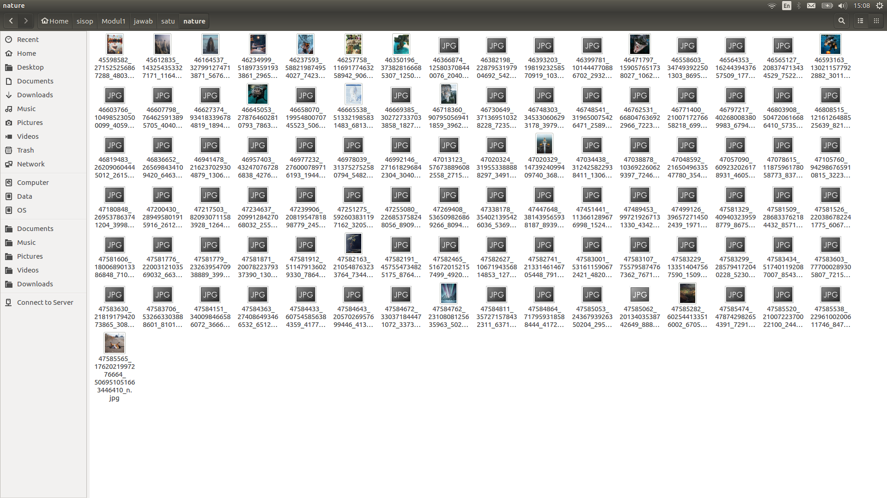
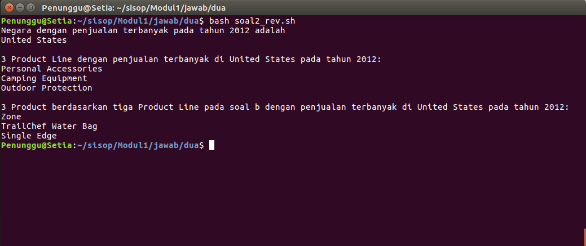

# SoalShift_modul1_B12

### Outline
+ [Soal 1](#soal-1)
    + [Basic Commands](#penyelesaian)
    + [Full Code](#full-code)
    + [Cronjob Soal1](#cronjob-soal1)
+ [Soal 2](#soal-2)
    + [2.a](#a)
    + [2.b](#b)
    + [2.c](#c)
+ [Soal 3](#soal-3)
    + [Kodingan ini](#kodingan-ini)
+ [Soal 4](#soal-4)
    + [Encrypt](#encrypt)
    + [Cronjob Soal4](#cronjob-soal4)
    + [Decrypt](#decrypt)
+ [Soal 5](#soal-5)
    + [Cronjob Soal5](#cronjob-soal5)

### Soal 1
Anda diminta tolong oleh teman anda untuk mengembalikan filenya yang telah
dienkripsi oleh seseorang menggunakan bash script, file yang dimaksud adalah
nature.zip. Karena terlalu mudah kalian memberikan syarat akan membuka seluruh
file tersebut jika pukul 14:14 pada tanggal 14 Februari atau hari tersebut adalah hari
jumat pada bulan Februari.
Hint: Base64, Hexdump

#### Penyelesaian:

Pertama-tama unzip isi dari nature.zip dengan perintah
```
unzip nature.zip
```
Setelah itu di akan muncul file-file `.jpg` yang tidak bisa dibuka (karena terenkripsi). Untuk mendekripsinya, gunakan perintah
```
base64 -d nama_file_input >> nama_file_output
```
+ base64 adalah perintah yang digunakan untuk mengenkripsi/mendekripsi data.
+ -d adalah argumen dari perintah base64 yang tujuannya agar perintah tersebut melakukan __dekripsi__.
Setelah itu, akan muncul file hasil dekripsinya. Tetapi bila dibuka, file itu masih dalam bentuk _hexdump_. Untuk melihat file tersebut dalam bentuk yang dapat dipahami manusia, gunakan perintah
```
xxd -r nama_file_input >> nama_file_output
```
+ xxd adalah perintah yang digunakan untuk membuat hexdump atau mengembalikan hexdump ke bentuk semula
+ -r adalah argumen dari perintah xxd yang tujuannya agar perintah tersebut mengembalikan file input ke bentuk semula.
Untuk memudahkan kita agar tidak perlu membuat suatu file output temporer, maka gunakan _pipe_ ( | ) agar output dari suatu perintah akan menjadi input untuk perintah yang dituliskan setelah tanda _pipe_. Maka dua perintah di atas akan menjadi
```
base64 -d nama_file_input | xxd -r > nama_file_output
```
Cara di atas adalah untuk mendekripsi satu buah file. Untuk mendekripsi seluruh isi directory _nature_, gunakan _script_ di bawah ini
##### [Full Code](soal1.sh):
```
#!/bin/bash
cd /home/Penunggu/sisop/Modul1/jawab/satu
unzip nature.zip

for file in "nature/"*
do
  base64 -d "$file" | xxd -r > $(basename "$file")
  echo "$file decrypted"
  mv $(basename "$file") nature
done
```
+ `#!/bin/bash` untuk memberitahu sistem bahwa perintah-perintah berikutnya harus dijalankan oleh Bash
+ `cd /home/Penunggu/sisop/Modul1/jawab/satu` _change directory_ ke path yang dituliskan (tempat file nature.zip berada). Dicantumkan agar dapat dijalankan melalui crontab
+ `unzip nature.zip` meng-unzip file _nature.zip_
+ `for file in "nature/"*` untuk setiap file (nama variabel) di directory nature
+ `do` lakukan
+ `base64 -d "$file" | xxd -r > $(basename "$file")` dekripsi file, output-nya akan berada di directory tempat script berada. $file adalah variabel yang berisi nama file pada iterasi tersebut. Nilainya adalah "nature/nama_file".
Perintah `basename "$file"` digunakan untuk mendapatkan nama file-nya saja tanda path directory-nya. Output dari perintah tersebut adalah "nama_file" dari "nature/nama_file".
$(basename "$file") maksudnya sama seperti _\`basename "$file"\`_
+ `echo "$file decrypted"` output text ke terminal saat file sudah terdekripsi
+ `mv $(basename "$file") nature` memindahkan file yang sudah terdekripsi ke dalam directory nature sehingga me-replace file di dalam directory nature yang masih terenkripsi
+ `done` penutup dari perintah `do`

##### Cronjob Soal1:
```
14 14 14 2 5 /bin/bash /home/Penunggu/sisop/Modul1/jawab/satu/soal1.sh
```
+ `14 14 14 2 5` maksudnya script yang dipilih akan dijalankan _“At 14:14 on day-of-month 14 and on Friday in February.”_ (by [crontab.guru](https://crontab.guru/#14_14_14_2_5))
+ `/bin/bash` untuk memberitahu agar script yang dipilih dijalankan menggunakan bash
+ `/home/Penunggu/sisop/Modul1/jawab/satu/soal1.sh` path tempat script yang ingin dipakai berada

Cara memeriksa berjalan atau tidaknya cronjob tersebut adalah dengan mengganti tanggal sistem menjadi tanggal yang harinya merupakan hari Jumat yang terdapat pada bulan Februari dan mengganti jamnya menjadi sebelum jam 14:14 (contoh 14:13:30). Setelah itu lakukan `sudo service cron restart`. Cek di direktori tempat file nature.zip berada apakah decrypt-nya berjalan.


### Soal 2
Anda merupakan pegawai magang pada sebuah perusahaan retail, dan anda diminta
untuk memberikan laporan berdasarkan file WA_Sales_Products_2012-14.csv.
Laporan yang diminta berupa:

a. Tentukan negara dengan penjualan(quantity) terbanyak pada tahun
2012.
b. Tentukan tiga product line yang memberikan penjualan(quantity)
terbanyak pada soal poin a.
c. Tentukan tiga product yang memberikan penjualan(quantity)
terbanyak berdasarkan tiga product line yang didapatkan pada soal
poin b.

#### Penyelesaian:
#### a.
Gunakan `awk`. Syntax yang akan digunakan adalah
```
awk -F, '/2012/ {a[$1]+=$10} END{for(i in a) print i",",a[i]}' WA_Sales_Products_2012-14.csv | sort -t $"," -n -k2 -r | awk -F, '{print $1}' | head -1
```
+ `-F,` adalah argumen untuk memberitahu awk bahwa pembatas tiap kolom dari data yang kita miliki adalah koma (,)
+ `/2012/` mencari record yang memiliki string tersebut
+ `{a[$1]+=$10}` menjumlahkan quantity (pada kolom ke-10) dari array 'a' yang memiliki 'index'/nama yang sama.
+ `END{for(i in a) print i",",a[i]}` melakukan loop sebanyak 'index' array 'a' dan mencetak 'index' (yang berisi nama-nama negara) dan isi dari 'index' tersebut (kuantitas tiap negara penjualan)
+ `WA_Sales_Products_2012-14.csv` nama file yang dijadikan input
+ `sort -t $"," -n -k2 -r` mengurutkan output dari perintah sebelumnnya dengan ketentuan,
     + `-t $","` pembatas tiap kolom adalah koma (,)
     + `-n` mengurutkan berdasarkan nilai numerik
     + `-k2` dari kolom ke-2
     + `-r` untuk me-reverse hasil pengurutan (dari ascending menjadi descending)
+ `awk -F, '{print $1}'` mencetak kolom pertama dari hasil perintah sebelumnya
+ `head -1` mencetak record urutan teratas dari hasil perintah sebelumnya

#### b.
Masih pakai `awk` dan memanfaatkan output dari perintah bagian a. 
```
awk -F, -v negara="$negara" '($1~negara) && ($7 == 2012) {a[$4]+=$10} END{for(i in a) print i",",a[i]}' WA_Sales_Products_2012-14.csv | sort -t $"," -n -k2 -r | head -3 | awk -F, '{print $1}'
```
+ `-v negara="$negara"` membuat variable _negara_ yang berisi $negara (variabel yang menyimpan output dari bagian a)
+ `($1~negara)` memeriksa apakah dalam record-record di kolom 1 terdapat string yang terkandung dalam variabel _negara_
+  `&&` meng-AND-kan syarat pencarian
+ `($7 == 2012)` memeriksa apakah dalam record-record di kolom 7 terdapat record yang bernilai 2012
+ `END{for(i in a) print i",",a[i]}' WA_Sales_Products_2012-14.csv | sort -t $"," -n -k2 -r | head -3 | awk -F, '{print $1}'` kurang lebih sama seperti sebelumnya, hanya berbeda pada `head -3` yang berarti record yang dicetak adalah 3 record teratas.

#### c.
Untuk bagian c ini saya memilih untuk melakukan _hard coding_. Berikut syntax kodenya untuk ketiga hasil
```
produk1="Personal Accessories"      #output dari jawaban soal b
produk2="Camping Equipment"         #output dari jawaban soal b
produk3="Outdoor Protection"        #output dari jawaban soal b
awk -F, -v produk1="$produk1" -v negara="$negara" -v produk2="$produk2" -v produk3="$produk3" '($1~negara) && (($4~produk1) || ($4~produk2) || ($4~produk3)) && ($7 == 2012) {a[$6]+=$10} END{for(i in a) print i",",a[i]}' WA_Sales_Products_2012-14.csv | sort -t $"," -n -k2 -r | head -3 | awk -F, '{print $1}'
```
Tidak beda jauh dengan sebelum-sebelumnya, hanya data yang diambil berbeda.
+ `(($4~produk1) || ($4~produk2) || ($4~produk3))` mengapa menggunakan OR? Agar record yang _mengandung salah satu dari ketiga variabel produk_ ikut terambil. Bukan record yang _memiliki/mengandung ketiga variabel produk tersebut secara bersamaan_.


### Soal 3
Buatlah sebuah script bash yang dapat menghasilkan password secara acak
sebanyak 12 karakter yang terdapat huruf besar, huruf kecil, dan angka. Password
acak tersebut disimpan pada file berekstensi .txt dengan ketentuan pemberian nama
sebagai berikut:

a. Jika tidak ditemukan file password1.txt maka password acak tersebut
disimpan pada file bernama password1.txt

b. Jika file password1.txt sudah ada maka password acak baru akan
disimpan pada file bernama password2.txt dan begitu seterusnya.

c. Urutan nama file tidak boleh ada yang terlewatkan meski filenya
dihapus.

d. Password yang dihasilkan tidak boleh sama.

#### Penyelesaian:
Dengan segala pertimbangan syarat di atas, muncullah
#### [Kodingan ini](soal3.sh) :
```
genpass() {
    pass=$(head /dev/urandom | tr -dc A-Za-z0-9 | head -c 12)
}
```
Fungsi untuk men-generate password-nya.
+ `pass=$(head /dev/urandom | tr -dc A-Za-z0-9 | head -c 12)` mengisi variabel _pass_ dengan output dari perintah di dalamnya (command ini saya pakai untuk generate password-nya)
     + `head /dev/urandom` mencetak bagian awal dari `/dev/urandom`
     + `tr -dc A-Za-z0-9` digunakan agar hanya tersisa character-character `a-z`, `A-Z`, dan `0-9` dari output perintah sebelumnya
     + `head -c 12` digunakan untuk mengambil 12 karakter pertama dari output perintah sebelumnya.

```
cek=1
while [ $cek == 1 ]
do
    if [[ $pass =~ [A-Z] ]]
    then
        if [[ $pass =~ [a-z] ]]
        then
            if [[ $pass =~ [0-9] ]]
            then
                cek=0
            else
                genpass
            fi
        else
            genpass
        fi
    else
        genpass
    fi
done
```
Melakukan pengecekan terhadap password yang di-generate. Apakah sudah memenuhi ketentuan atau belum. Bila belum sesuai ketentuan, password baru akan di-generate.
+ `if [[ $pass =~ [A-Z] ]]` memeriksa apakah value $pass mengandung huruf besar
+ `if [[ $pass =~ [a-z] ]]` memeriksa apakah value $pass mengandung huruf kecil
+ `if [[ $pass =~ [0-9] ]]` memeriksa apakah value $pass mengandung angka
+ bila cek = 0 maka password sudah memenuhi ketentuan dan keluar dari loop.
```
jml=0
for files in password*.txt
do
    let "jml++"
done
iter=$jml
```
Melakukan iterasi untuk mendapatkan jumlah file password*.txt yang sudah ada
+ `jml=0` inisialisasi variabel _jml_ untuk menyimpan jumlah file password*.txt yang sudah ada
+ `iter=$jml` inisialisasi variabel _iter_ untuk kepentingan pengecekan kesamaan password

```
while [ $iter -gt 0 ]
do
  if [ "$pass" == "$(cat ./password"$iter".txt)" ]
  then
    genpass
    iter=$jml
  else
    let "iter--"
  fi
done
```
Melakukan iterasi untuk memeriksa apakah password yang baru di-generate sudah berbeda dari password-password yang sudah ada.

```
while [ -f ./password"$i".txt ]
do
    let "i++"
done
```
Menemukan nilai _i_ untuk nama file password yang akan dibuat (sehingga bila ada _i_ yang terlompati maka akan diisi)
+ `while [ -f ./password"$i".txt ]` selama ada file yang bernama password"$i".txt maka perintah-perintah dalam while akan dijalankan.
+ `let "i++"` menambah nilai _i_ sebanyak 1 setiap iterasi terjadi

```
echo "$pass" >> password"$i".txt
```
+ `echo "$pass" >> password"$i".txt` bila pemeriksaan-pemeriksaan di atas telah dilewati, perintah ini lah yang akan menyimpan password-nya ke dalam file.
    + `echo "$pass"` meng-output-kan variabel $pass
    + `>> password"$i".txt` menyimpan output dari dari perintah sebelumnya ke dalam file password"$i".txt dimana $i adalah nilai i terakhir setelah berbagai pengecekan yang telah dilalui.

### Soal 4
Lakukan backup file syslog setiap jam dengan format nama file “jam:menit tanggal-
bulan-tahun”. Isi dari file backup terenkripsi dengan konversi huruf (string
manipulation) yang disesuaikan dengan jam dilakukannya backup misalkan sebagai
berikut:

a. Huruf b adalah alfabet kedua, sedangkan saat ini waktu menunjukkan
pukul 12, sehingga huruf b diganti dengan huruf alfabet yang memiliki
urutan ke 12+2 = 14.

b. Hasilnya huruf b menjadi huruf n karena huruf n adalah huruf ke
empat belas, dan seterusnya.

c. setelah huruf z akan kembali ke huruf a

d. Backup file syslog setiap jam.

e. dan buatkan juga bash script untuk dekripsinya.

#### Penyelesaian:
#### Encrypt
```
nama=$(date '+%H:%M %d-%m-%Y')
```
Menyimpan format nama file dengan perintah _date_ dan menyimpannya dalam variabel nama.
```
sif=$(date '+%H')
```
Menyimpan jam dalam variabel _sif_ untuk menentukan pergeseran huruf-huruf.
```
decbase=$(printf "%d" "'a")
```
Mendapatkan nilai decimal dari karakter 'a' dan menyimpannya dalam variabel _decbase_ untuk kepentingan pergeseran
```
keydec=`expr $decbase + $sif`
```
Mendapatkan nilai decimal dari karakter yang sudah dienkripsi (digeser). Selanjutnya akan kita sebut 'key'.
```
keyhex=$(bc <<<"obase=16;$keydec")
```
Mendapatkan nilai hexadecimal dari karakter 'key' dan menyimpannya dalam variabel _keyhex_ untuk memunculkannya kembali ke bentuk 'huruf'.
+ `bc <<<"obase=16;$keydec"` di sini saya memanfaatkan _command_ `bc` (Basic Calculator) untuk mengubah value dari $keydec (yang merupakan decimal) menjadi basis 16 atau hexadecimal. Bentuk lain dari _command_ tersebut adalah `echo "ibase=10;obase=16;97" | bc -l
`
```
key=$(echo $keyhex | xxd -p -r)
```
Mengubah nilai hexadecimal yang sudah didapat menjadi bentuk karakter(huruf)-nya dan menyimpannya dalam variabel _key_.
```
keydec1=`expr $keydec - 1`
```
Mendapatkan nilai decimal dari karakter dalam alphabet yang terletak sebelum karakter 'key'. Selanjutnya akan disebut 'key-1'.
```
key1hex=$(bc <<<"obase=16;$keydec1")
```
Mendapatkan nilai hexadecimal dari 'key-1' dan menyimpannya dalam variabel _key1hex_ untuk memunculkannya kembali ke bentuk 'huruf'.
```
key1=$(echo $key1hex | xxd -p -r)
```
Mengubah nilai hexadecimal 'key-1' yang sudah didapat menjadi bentuk karakter(huruf)-nya.

```
decbaseup=$(printf "%d" "'A")
keyupdec=`expr $decbaseup + $sif`
keyuphex=$(bc <<<"obase=16;$keyupdec")
keyup=$(echo $keyuphex | xxd -p -r)

keydecup1=`expr $keyupdec - 1`
keyup1hex=$(bc <<<"obase=16;$keydecup1")
keyup1=$(echo $keyup1hex | xxd -p -r)
```
Sama seperti proses sebelumnya tetapi untuk huruf besar (uppercase).
```
cat /var/log/syslog | tr [a-zA-Z] [$key-za-$key1$keyup-ZA-$keyup1] >> "$nama"
```
+ `cat /var/log/syslog` Membaca file syslog yang akan di-back-up
+ `tr [a-zA-Z] [$key-za-$key1$keyup-ZA-$keyup1]` menggeser huruf-huruf pada output perintah sebelumnya agar 'a' menjadi karakter 'key' dan huruf-huruf setelah 'a' menjadi huruf-huruf setelah 'key'. Bila sudah melewati 'z' maka akan kembali ke 'a' (seperti pada permintaan soal). Ini merupakan perintah 'enkripsi'-nya.
+ `>> "$nama"` menyimpan output dari perintah sebelumnya dalam file yang namanya merupakan isi dari variable $name
```
if [ $sif == "00" ]
then
    cat /var/log/syslog >> "$nama"
    exit
fi
```
Barisan kode di atas adalah untuk _case_ saat _backup_ dilakukan pada jam 00 dimana tidak terjadi pergeseran huruf-huruf (enkripsi). 

[Full encrypt code](soal4_encrypt.sh)

##### Cronjob Soal4:
0 * * * * /bin/bash /home/Penunggu/sisop/Modul1/jawab/empat/soal4_encrypt.sh
+ `0 * * * *` artinya script yang dipilih akan dijalankan “At minute 0.” (by [crontab.guru](https://crontab.guru/#0_*_*_*_*) yang artinya sama dengan "every hour" atau "setiap jam"
+ `/bin/bash` untuk memberitahu agar script yang dipilih dijalankan menggunakan bash
+ `/home/Penunggu/sisop/Modul1/jawab/empat/soal4_encrypt.sh` path tempat script yang ingin dipakai berada
+ Karena tidak dispesifikkan, file output akan berada di direktori `/home/[user]`

#### Decrypt
Untuk dekripsi, mirip dengan enkripsi. Perbedaannya terletak pada pengambilan nilai dari variabel $sif dan perintah dekripsinya
Pengambilan nilai variabel $sif:
```
sif=$(echo "$1" | head -c 2)
```
+ Meng-output-kan argumen pertama yang di-input-kan (yang seharusnya adalah nama file yang ingin didekripsi) saat script ini dijalankan.
+ `| head -c 2` Mengambil dua karakter awal dari output perintah sebelumnya (yang seharusnya adalah jam kapan file tersebut dienkripsi)

Perintah dekripsi:
```
cat "$1" | tr [$key-za-$key1$keyup-ZA-$keyup1] [a-zA-Z] >> "$1"_decrypted
```
+  `cat "$1"` membaca file yang namanya dimasukkan sebagai argumen pertama saat memanggil script ini. Dalam kata lain, file yang ingin didekripsi
+ `tr [$key-za-$key1$keyup-ZA-$keyup1] [a-zA-Z]` kebalikan dari perintah enkripsi. Perintah ini mengembalikan pergeseran sehingga 'key' akan kembali menjadi 'a' dan seterusnya.
+ `>> "$nama"_decrypted` menyimpan output dari perintah sebelumnya dalam file yang namanya merupakan isi dari variable $name ditambahkan string "\_decrypted" di belakangnya

[Full decrypt code](soal4_decrypt.sh)

Syntax untuk melakukan dekripsi adalah `bash soal4_decrypt.sh "nama_file_yang_ingin_didekripsi"`.

### Soal 5
Buatlah sebuah script bash untuk menyimpan record dalam syslog yang memenuhi
kriteria berikut:

a. Tidak mengandung string “sudo”, tetapi mengandung string “cron”,
serta buatlah pencarian stringnya tidak bersifat case sensitive,
sehingga huruf kapital atau tidak, tidak menjadi masalah.

b. Jumlah field (number of field) pada baris tersebut berjumlah kurang
dari 13.

c. Masukkan record tadi ke dalam file logs yang berada pada direktori
/home/[user]/modul1.

d. Jalankan script tadi setiap 6 menit dari menit ke 2 hingga 30, contoh
13:02, 13:08, 13:14, dst.

#### Penyelesaian
Tuliskan [script ini](soal5.sh):
```
#!/bin/bash

awk '!/[Ss][Uu][Dd][Oo]/ && /[Cc][Rr][Oo][Nn]/ {if(NF<13) print}' /var/log/syslog >> /home/Penunggu/modul1/logs
```
+ `awk` menggunakan perintah awk
+ `!/[Ss][Uu][Dd][Oo]/` mencari record yang tidak (!) mengandung "sudo" (case insensitive) di dalamnya.
+ `/[Cc][Rr][Oo][Nn]/` mencari record yang mengandung "cron" (case insensitive) di dalamnya.
+ `{if(NF<13) print}` jika field pada record tersebut kurang dari 13 maka baris tersebut akan dicetak
+ `/var/log/syslog` file yang akan diproses
+ `>> /home/Penunggu/modul1/logs` path dari file yang menyimpan output dari perintah sebelumnya. Menggunakan ">>" agar saat dilakukan back-up lagi maka hasilnya akan ter-_append_ (ditambahkan di bawahnya).

##### Cronjob Soal5:
```
2-30/6 * * * * /bin/bash /home/Penunggu/sisop/Modul1/jawab/lima/logscript.sh
```
+ `2-30/6 * * * *` artinya script yang dipilih akan dijalankan “At every 6th minute from 2 through 30.” (by [crontab.guru](https://crontab.guru/#2-30/6_*_*_*_*))
+ `/bin/bash` untuk memberitahu agar script yang dipilih dijalankan menggunakan bash
+ `/home/Penunggu/sisop/Modul1/jawab/lima/soal5.sh` path tempat script yang ingin dipakai berada

